# 📈 Stock Market Simulation App

Welcome to the Stock Market Simulation App! This app is designed to allow users to simulate buying
and selling stocks, add them to their watchlist, view stock details, and share their profiles with
others.

## 📁 Project Structure

The project is structured into two important folders: `app` and `api`.

The `app` folder contains the Android app, which was made using Kotlin.

The `api` folder contains a Hono Cloudflare Workers Edge API, which uses PlanetScale as a serverless
database. The API was created using TypeScript.

## 🚀 Installation

## Backend

To run the backend (the API), follow these steps:

Choose a node package manager of your choice, for example [`pnpm`](https://pnpm.io/).

1. Navigate to the `api` folder in your terminal.
2. Copy the .dev.vars file.example to .dev.vars and fill in the required values.
3. Install dependencies using your preferred package manager: `pnpm install`
4. Generate the prisma edge client: `pnpm prisma generate --data-proxy`
5. Push the db schema to PlanetScale: `pnpm prisma db push`
6. Start the API: `pnpm dev`

## Frontend

To run the frontend (the Android app), follow these steps:

1. Open the project in Android Studio.
2. Open the strings.xml file in the `app/src/main/res/values` folder.
3. Edit the `default_web_client_id` to match your backend's google web id.
4. Change the base url to match your backend's url.
5. Run the app.
6. Enjoy!

## 📸 Demo

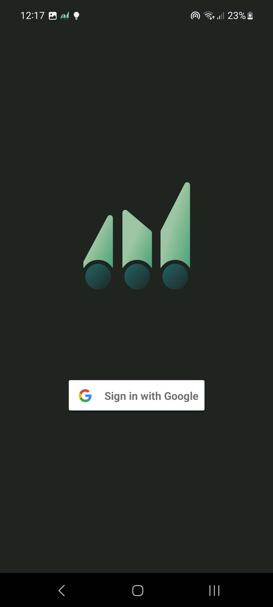
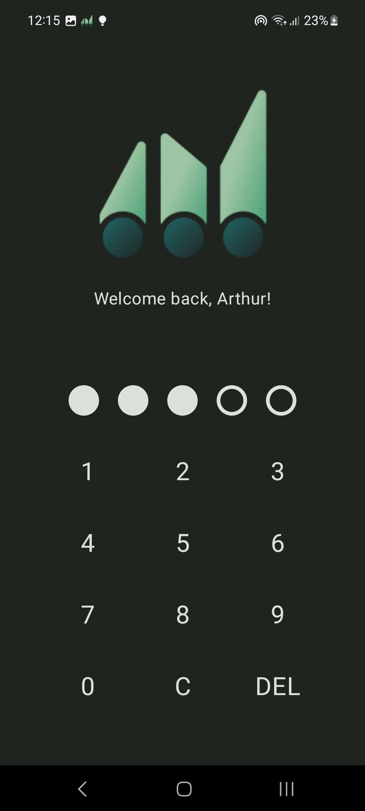
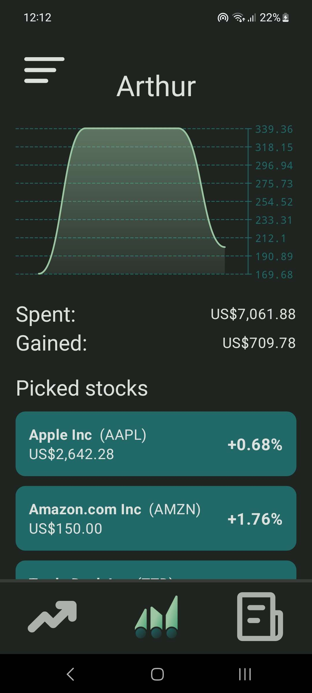
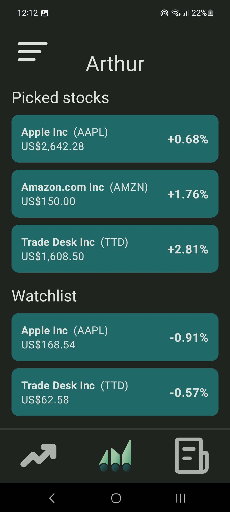
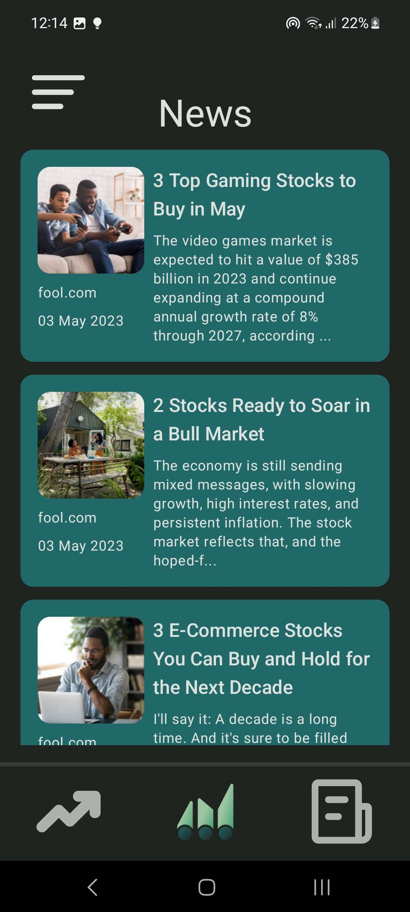
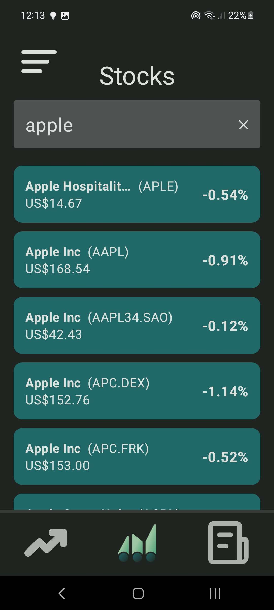
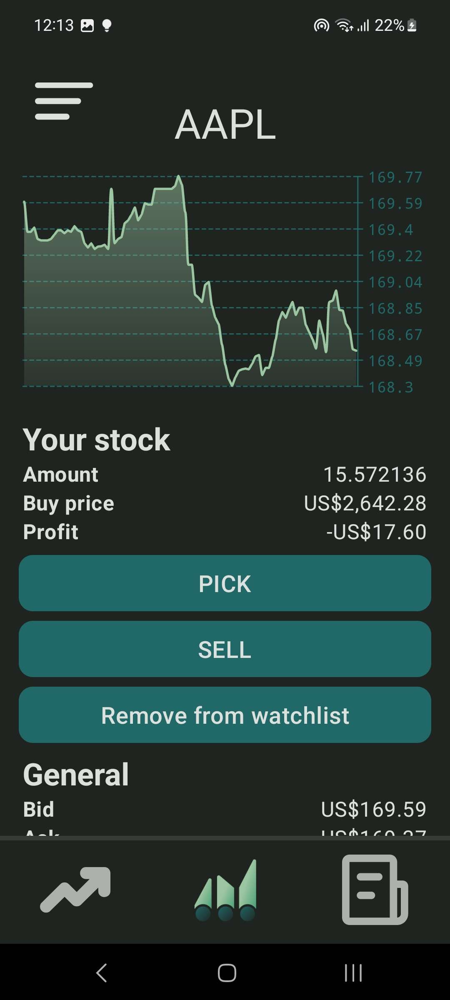
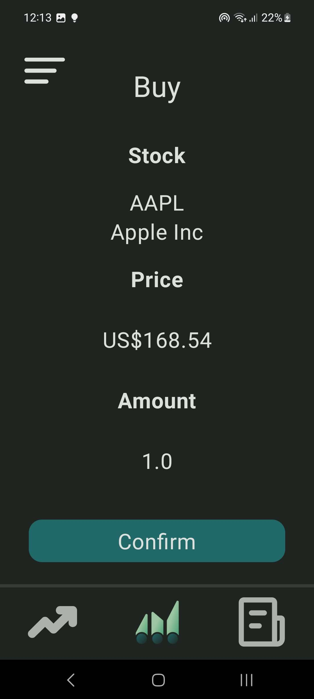
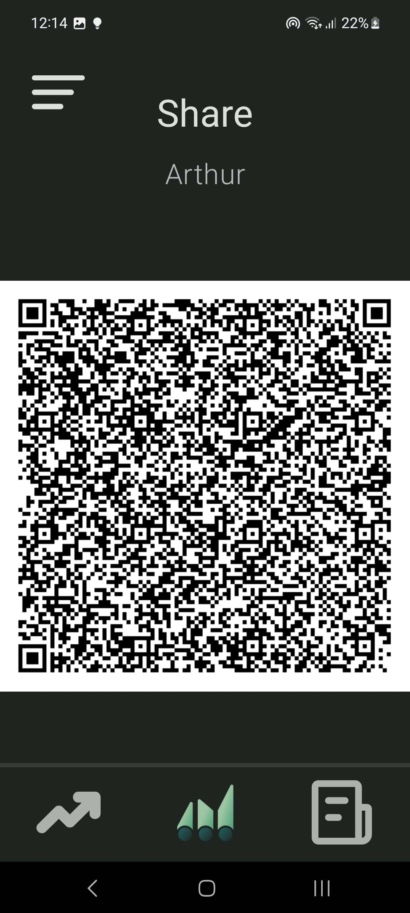
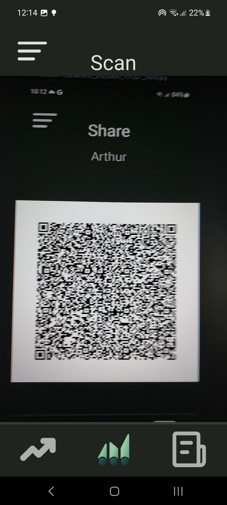
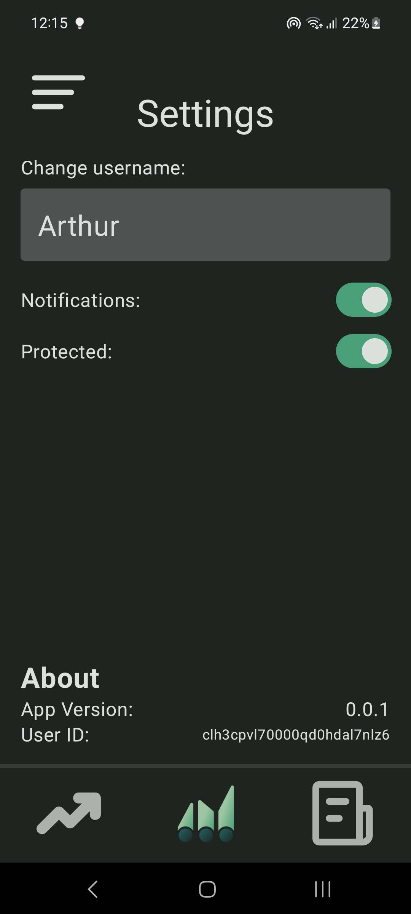

## 📝 License

This project is licensed under the MIT License. See the **[LICENSE](./LICENSE)** file for more
information.

---

Created by Arthur De Witte for the Native Mobile Apps course *(part of the Applied Computer Science
study)* at Howest University.